# 基于用户体验的性能指标

[基于⽤户体验的性能指标](https://web.dev/metrics/)是 Google 在 web.dev 提出的。

## First Contentful Paint (FCP)
FCP（First Contentful Paint）⾸次内容绘制，浏览器 **⾸次绘制来⾃ DOM 的内容** 的时间，内容必须是⽂ 本、图⽚（包含背景图）、⾮⽩⾊的 canvas 或 SVG，也包括带有正在加载中的 Web 字体的⽂本。
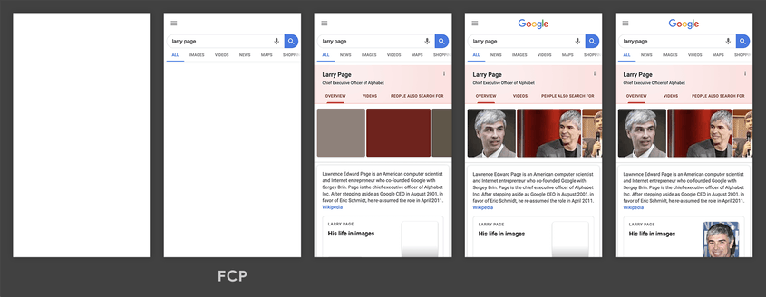

在上方的加载时间轴中，FCP 发生在第二帧，因为那是首批文本和图像元素在屏幕上完成渲染的时间点。

您会注意到，虽然部分内容已完成渲染，但并非所有内容都已经完成渲染。这是首次内容绘制 (FCP) 与**Largest Contentful Paint 最大内容绘制 (LCP)**（旨在测量页面的主要内容何时完成加载）之间的重要区别。

### 速度指标
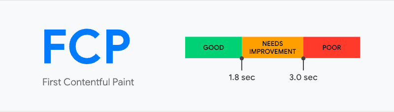

FCP 时间（以秒为单位）|颜色编码| FCP分数（HTTP 存档百分位数）
---|---|---
0-2 | 绿色（快速） | 75-100
2-4 | 橙色（中等） | 50-74
超过4 | 红色（慢） | 0-49

### 优化方案
* https://web.dev/fcp/#how-to-improve-fcp

## Largest Contentful Paint (LCP)
LCP（Largest Contentful Paint）最⼤内容绘制，**可视区域中最⼤的内容元素**呈现到屏幕上的时间，⽤以估算⻚⾯的主要内容对⽤户可⻅时间。

LCP 考虑的元素： 

* `` 元素 
* 内嵌在 `<svg>` 元素内的 `<image>` 元素 
* `<video>` 元素（封⾯图） 
* 通过 `url()` 函数（而非使用**CSS 渐变**）加载的滴啊有背景图像的元素 
* 包含⽂本节点或其他内联级⽂本元素⼦级的**块级**元素 

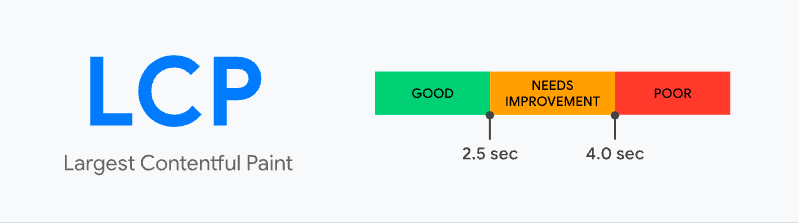

为了提供良好的⽤户体验，⽹站应⼒争使⽤ 2.5 秒或更短的“最⼤内容绘画” 。为确保你达到⼤多数⽤户的这⼀⽬标，衡量移动设备和台式机设备的⻚⾯加载量的第75个百分位数是⼀个很好的衡量标准。

以下示例展示了一些热门网站上出现最大内容绘制的时间点：

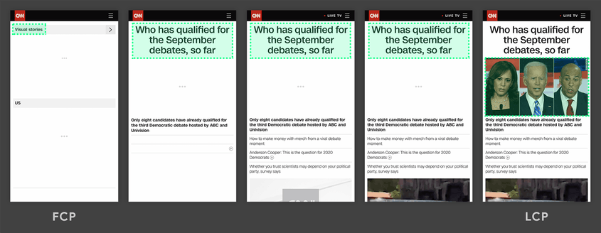
在上方的两个时间轴中，最大元素随内容加载而变化。在第一个示例中，新内容被添加进 DOM，并因此使最大元素发生了改变。在第二个示例中，由于布局的改变，先前的最大内容从可视区域中被移除。

虽然延迟加载的内容通常比页面上已有的内容更大，但实际情况并非一定如此。接下来的两个示例显示了在页面完全加载之前出现的最大内容绘制。

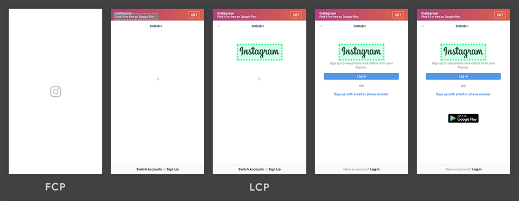

在第一个示例中，Instagram 标志加载得相对较早，即使其他内容随后陆续显示，但标志始终是最大元素。在 Google 搜索结果页面示例中，最大元素是一段文本，这段文本在所有图像或标志完成加载之前就显示了出来。由于所有单个图像都小于这段文字，因此这段文字在整个加载过程中始终是最大元素。

> 在 Instagram 时间轴的第一帧中，您可能注意到了相机标志的周围没有用绿框框出。这是因为该标志是一个 `<svg>` 元素，而 `<svg>` 元素目前不被视为 LCP 候选对象。首个 LCP 候选对象是第二帧中的文本。

### 速度指标

LCP 时间（以秒为单位）|颜色编码
---|---|---
0-2.5 | 绿色（快速） 
2.5-4 | 橙色（中等） 
超过4 | 红色（慢） 

### 优化方案
* https://web.dev/optimize-lcp/

## First Input Delay (FID)
FID（First Input Delay）⾸次输⼊延迟，从⽤户第⼀次与⻚⾯交互（例如单击链接、点击按钮等）到浏览 器实际能够响应该交互的时间。 

输⼊延迟是因为浏览器的主线程正忙于做其他事情，所以不能响应⽤户。发⽣这种情况的⼀个常⻅原因是浏览器正忙于解析和执⾏应⽤程序加载的⼤量计算的 JavaScript。 

第⼀次输⼊延迟通常发⽣在第⼀次内容绘制（FCP）和 Time To Interactive 可持续交互时间（TTI）之间，因为⻚⾯已经呈现了⼀些内容，但还不能可靠地交互。

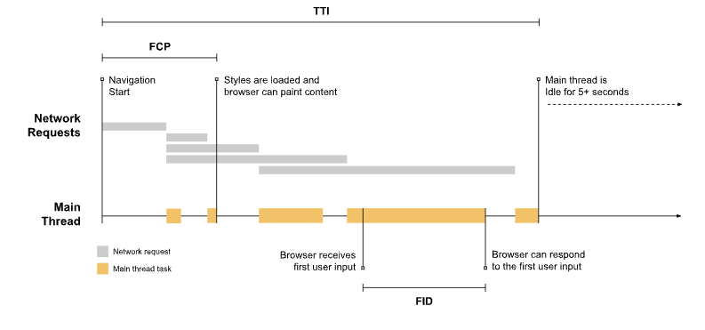

因为输入发生在浏览器正在运行任务的过程中，所以浏览器必须等到任务完成后才能对输入作出响应。浏览器必须等待的这段时间就是这位用户在该页面上体验到的 FID 值。

> 在这个示例中，用户恰好在主线程刚进入最繁忙的时段时与页面进行了交互。如果用户稍微提早一点（在空闲期间）与页面进行交互，那么浏览器就会立即响应。输入延迟上的这种差异强调了在报告指标时查看 FID 值分布的重要性。

如果交互没有事件侦听器怎么办？ 

FID 测量接收到输入事件的时间点与主线程下一次空闲的时间点之间的差值。这就意味着**即使在尚未注册事件侦听器的情况下，** FID 也会得到测量。这是因为许多用户交互的执行并不需要事件侦听器，但一定需要主线程处于空闲期。

例如，在对用户交互进行响应前，以下所有 HTML 元素都需要等待主线程上正在进行的任务完成运行：

* 文本字段、复选框和单选按钮 (`<input> 、 <textarea>`)
* 下拉选择列表（`<select>`）
* 链接 (`<a>`)

### 速度指标
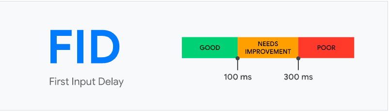

### 优化方案
* https://web.dev/fid/#how-to-improve-fid 
* https://web.dev/optimize-fid/

## Time to Interactive (TTI)
TTI (Time to Interactive) 可交互时间指标，测量页面从开始加载到主要子资源完成渲染，并能够快速、可靠地响应用户输入所需的时间。

表示⽹⻚第⼀次 **完全达到可交互状态** 的时间点，浏览器已经可以持续性的响应⽤户的输⼊。**完全达到可交互状态**的时间点是在最后⼀个⻓任务（Long Task）完成的时间, 并且在随后的 5 秒内⽹络和主线程是空闲的。 从定义上来看，中⽂名称叫**可持续交互时间**或**可流畅交互时间**更合适。

> 长任务是需要 50 毫秒以上才能完成的任务

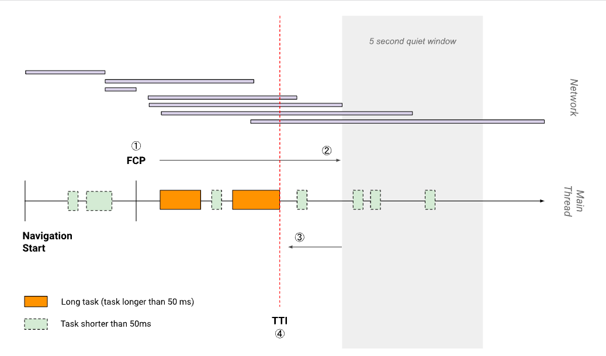

### 速度指标

TTI 指标（以秒为单位）|颜色编码
---|---|---
0-3.8 | 绿色（快速） 
3.9-7.3 | 橙色（中等） 
超过7.3 | 红色（慢）

### 优化方案
* https://web.dev/tti/#how-to-improve-tti

## Total Blocking Time (TBT)
TBT (Total Blocking Time) 总阻塞时间指标，测量 FCP (First Contentful Paint) 首次内容绘制与 TTI (Time to Interactive) 可持续交互时间之间的总时间，这期间，主线程被阻塞的时间过长，无法做出输入响应。

每当出现长任务（在主线程上运行超过 50 毫秒的任务）时，主线程都被视作"阻塞状态"。我们说主线程处于"阻塞状态"是因为浏览器无法中断正在进行的任务。因此，如果用户在某个长任务运行期间与页面进行交互，那么浏览器必须等到任务完成后才能作出响应。

如果任务时长足够长（例如超过 50 毫秒），那么用户很可能会注意到延迟，并认为页面缓慢或卡顿。

某个给定长任务的阻塞时间是该任务持续时间超过 50 毫秒的部分。一个页面的总阻塞时间是在 FCP 和 TTI 之间发生的每个长任务的阻塞时间总和。

例如，请看以下这张页面加载期间浏览器主线程的图表：

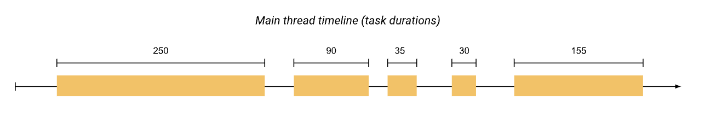

上方的时间轴上有五个任务，其中三个是长任务，因为这些任务的持续时间超过 50 毫秒。下图显示了各个长任务的阻塞时间：

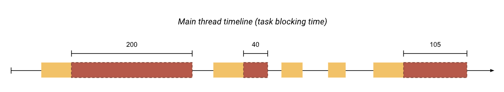

因此，虽然在主线程上运行任务的总时间为 560 毫秒，但其中只有 345 毫秒被视为阻塞时间。

TBT 与 TTI 有什么关系？ 
TBT 是 TTI 的一个出色的配套指标，因为 TBT 有助于量化在页面交互性变为可靠前，不可交互程度的严重性。

TTI 会在主线程至少有五秒钟没有长任务时，认为页面具备"可靠交互性"。也就是说，分布在 10 秒钟里的三个 51 毫秒长的任务与单个 10 秒长的任务对 TTI 的影响是相同的，但对于试图与页面进行交互的用户来说，这两种情况给人的感觉是截然不同的。

在第一种情况下，三个 51 毫秒的任务的 TBT 为3 毫秒。而单个 10 秒长的任务的 TBT 为9950 毫秒。第二种情况下较大的 TBT 值对较差的体验进行了量化。

### 速度指标

TBT 时间（以毫秒为单位）|颜色编码
---|---|---
0-300 | 绿色（快速） 
300-600 | 橙色（中等） 
超过600 | 红色（慢）

### 优化方案
* https://web.dev/tbt/#how-to-improve-tbt

## Cumulative Layout Shift (CLS)
Cumulative Layout Shift（CLS）累计布局偏移，CLS 测量整个页面生命周期内发生的所有意外布局偏移中最大一连串的布局偏移分数，它测量视觉稳定性的一个以用户为中心的重要指标，因为该项指标有助于量化用户经历意外布局偏移的频率，较低的 CLS 有助于确保一个页面是令人愉悦的。

每当一个可见元素的位置从一个已渲染帧变更到下一个已渲染帧时，就发生了布局偏移 。

一连串的布局偏移，也叫会话窗口，是指一个或多个快速连续发生的单次布局偏移，每次偏移相隔的时间少于 1 秒，且整个窗口的最大持续时长为 5 秒。

最大的一连串是指窗口内所有布局偏移累计分数最大的会话窗口。

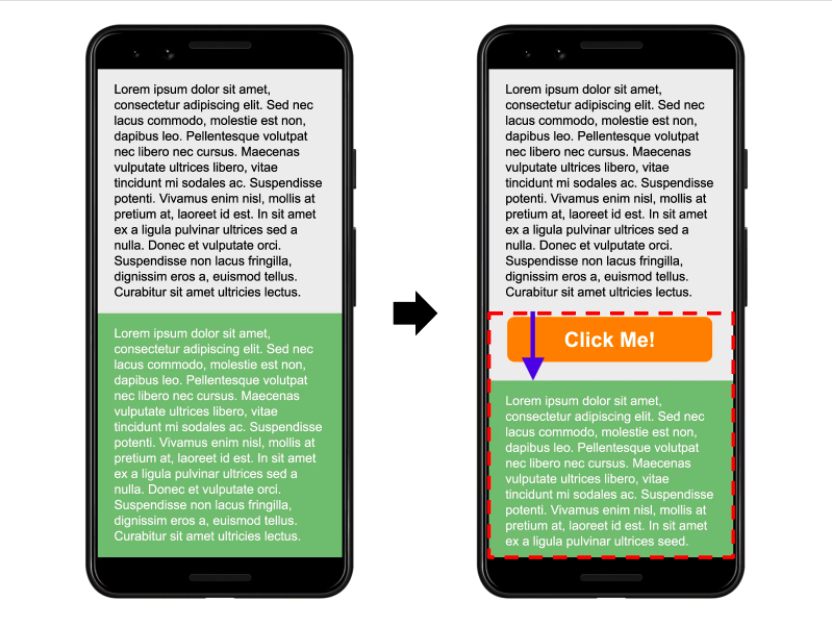

你是否曾经历过在网上阅读一篇文章，结果页面上的某些内容突然发生改变？文本在毫无预警的情况下移位，导致你找不到先前阅读的位置。或者更糟糕的情况：你正要点击一个链接或一个按钮，但在手指落下的瞬间，该链接移位了，结果你点到了别的东西！

大多数情况下，这些体验只是令人恼火，但在某些情况下，却可能带来真正的破坏。

页面内容的意外移动通常是由于异步加载资源，或者动态添加 DOM 元素到页面现有内容的上方。罪魁祸首可能是未知尺寸的图像或视频、实际渲染后比后备字体更大或更小的字体，或者是动态调整自身大小的第三方广告或小组件。

### 速度指标

CLS 时间（以毫秒为单位）|颜色编码
---|---|---
0-0.1 | 绿色（快速） 
0.1-0.25 | 橙色（中等） 
超过0.25 | 红色（慢）

### 优化方案
* https://web.dev/cls/#how-to-improve-cls 
* https://web.dev/optimize-cls/