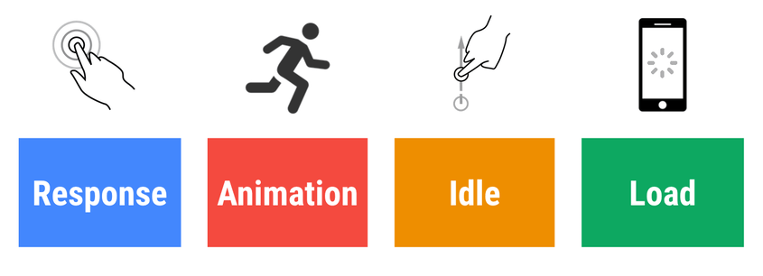
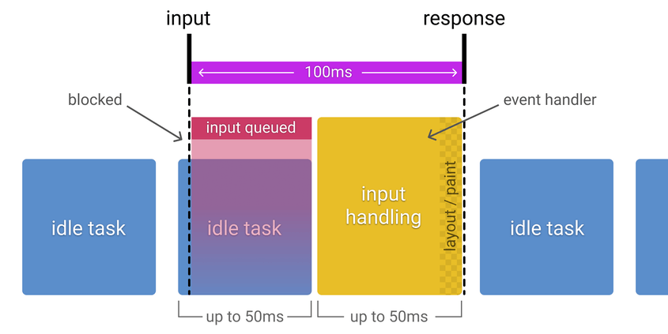

# RAIL 性能模型

`RAIL` 是 `Response, Animation, Idle, 和 Load` 的⾸字⺟缩写, 是⼀种由 Google Chrome 团队于 2015 年提出的性能模型, ⽤于提升浏览器内的⽤户体验和性能。 

`RAIL` 模型的理念是”以⽤户为中⼼，最终⽬标不是让您的⽹站在任何特定设备上都能运⾏很快，⽽是使⽤ 户满意”

* 响应（Response）：应该尽可能快速的响应⽤户, 应该在 100ms 以内响应⽤户输⼊。 
* 动画（Animation）：在展示动画的时候，每⼀帧应该以 16ms 进⾏渲染，这样可以保持动画效果的⼀ 致性，并且避免卡顿。 
* 空闲（Idle）：当使⽤ Javascript 主线程的时候，应该把任务划分到执⾏时间⼩于 50ms 的⽚段中去，这样可以释放线程以进⾏⽤户交互。 
* 加载（Load）：应该在⼩于 1s 的时间内加载完成你的⽹站，并可以进⾏⽤户交互。

> 根据⽹络条件和硬件的不同，⽤户对性能延迟的理解也有所不同。例如，通过快速的 Wi-Fi 连接在功能强⼤的台式机上加载站点通常在 1 秒内完成，⽤户对此已经习以为常。在 3G 连接速度较慢的移动设备上加载⽹站需要花费更多时间，因此移动⽤户通常更耐⼼，在移动设备上加载 5s 是⼀个更现实的⽬标。

这四个单词代表与⽹站或应⽤的⽣命周期相关的四个⽅⾯，这些⽅⾯会以不同的⽅式影响整个⽹站的性能。

我们将⽤户作为之后性能优化的中⼼，⾸先需要了解⽤户对于延迟的反应。⽤户感知延迟的时间窗⼝，如下表所示。 

延迟|用户反映
---|---|---
0 ~ 16ms | ⼈眼可以感知每秒 60 帧的动画，即每帧 16 ms，除了浏览器将⼀帧画⾯绘制到屏幕上的时间，⽹站应⽤⼤约需要 10ms 来⽣成⼀帧
0 ~ 100ms | 在该时间范围内响应⽤户操作，才会是流畅的体验
100 ~ 1000ms | 能够感觉到明显的延迟
>1s | ⽤户的注意⼒将离开对执⾏任务的关注
>10s | ⽤户感到失望，可能会放弃任务
## 响应

指标：应该尽可能快速的响应⽤户，应该在 100ms 以内响应⽤户输⼊。 

⽹站性能对于响应⽅⾯的要求是，在⽤户感知延迟之前接收到操作的反馈。⽐如⽤户进⾏了⽂本输⼊、按钮单击、表单切换及启动动画等操作后，必须在 100ms 内收到反馈，如果超过 100ms 的时间窗⼝，⽤户就会感知延迟。 

看似很基本的⽤户操作背后，可能会隐藏着复杂的业务逻辑处理及⽹络请求与数据计算。对此我们应当谨慎，将较⼤开销的⼯作放在后台异步执⾏，⽽即便后台处理要数百毫秒才能完成的操作，也应当给⽤户提供及时的阶段性反馈。 

⽐如在单击按钮向后台发起某项业务处理请求时，⾸先反馈给⽤户开始处理的提示，然后在处理完成的回调后反馈完成的提示。 加载⽹站需要花费更多时间，因此移动⽤户通常更耐⼼，在移动设备上加载 5s 是⼀个更现实的⽬标。

## 动画
指标：在展示动画的时候，每⼀帧应该以 10ms 进⾏渲染，这样可以保持动画效果的⼀致性，并且避免卡顿。

前端所涉及的动画不仅有炫酷的UI特效，还包括滚动和触摸拖动等交互效果，⽽这⼀⽅⾯的性能要求就是流畅。众所周知，⼈眼具有视觉暂留特性，就是当光对视⽹膜所产⽣的视觉在光停⽌作⽤后，仍能保留⼀段时间。 

研究表明这是由于视神经存在反应速度造成的，其值是 1/24s，即当我们所⻅的物体移除后，该物体在我们眼中并不会⽴即消失，⽽会延续存在 1/24s 的时间。对动画来说，⽆论动画帧率有多⾼，最后我们仅能分辨其中的 30 帧，但越⾼的帧率会带来更好的流畅体验，因此动画要尽⼒达到 60fps 的帧率。 

⽬前⼤多数设备的屏幕刷新率为 60 次/秒，那么浏览器渲染动画或⻚⾯的每⼀帧的速率也需要跟设备屏幕 的刷新率保持⼀致。所以根据 60fps 帧率的计算，每⼀帧画⾯的⽣成都需要经过若⼲步骤，⼀帧图像的⽣ 成预算为 16ms（1000ms / 60 ≈ 16.66ms），除去浏览器绘制新帧的时间，留给执⾏代码的时间仅 10ms 左右。如果⽆法符合此预算，帧率将下降，并且内容会在屏幕上抖动。 此现象通常称为卡顿，会对 ⽤户体验产⽣负⾯影响。关于这个维度的具体优化策略，会在后⾯优化渲染过程的相关章节中详细介绍。

* https://googlechrome.github.io/devtools-samples/jank/

## 空闲
指标：当使⽤ Javascript 主线程的时候，应该把任务划分到执⾏时间⼩于 50ms 的⽚段中去，这样可以 释放线程以进⾏⽤户交互。 

要使⽹站响应迅速、动画流畅，通常都需要较⻓的处理时间，但以⽤户为中⼼来看待性能问题，就会发现并⾮所有⼯作都需要在响应和加载阶段完成，我们完全可以利⽤浏览器的空闲时间处理可延迟的任务，只要让⽤户感受不到延迟即可。利⽤空闲时间处理延迟，可减少预加载的数据⼤⼩，以保证⽹站或应⽤快速完成加载。 

为了更加合理地利⽤浏览器的空闲时间，最好将处理任务按 50ms 为单位分组。这么做就是保证⽤户在发 ⽣操作后的 100ms 内给出响应

## 加载
指标：⾸次加载应该在⼩于 5s 的时间内加载完成，并可以进⾏⽤户交互。对于后续加载，则是建议在2秒 内完成。 

⽤户感知要求我们尽量在 5s 内完成⻚⾯加载，如果没有完成，⽤户的注意⼒就会分散到其他事情上，并对当前处理的任务产⽣中断感。需要注意的是，这⾥在 5s 内完成加载并渲染出⻚⾯的要求，并⾮要完成所有⻚⾯资源的加载，从⽤户感知体验的⻆度来说，只要关键渲染路径完成，⽤户就会认为全部加载已完成。

对于其他⾮关键资源的加载，延迟到浏览器空闲时段再进⾏，是⽐较常⻅的渐进式优化策略。⽐如图⽚懒加载、代码拆分等优化⼿段。 

关于加载⽅⾯具体的优化⽅案，后续也会分出独⽴内容进⾏详细介绍。